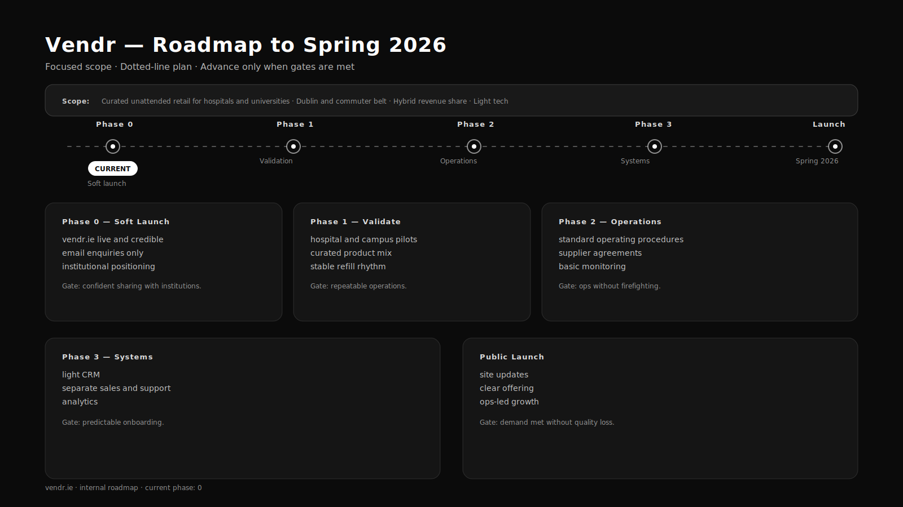

# SV — VNTA Subsidiary (SvelteKit)

This repository contains a **SvelteKit project scaffolded with [`sv`](https://github.com/sveltejs/cli)** and maintained as a **subsidiary of VNTA (Vantanéant International)**.

The project adheres to VNTA’s principles of restraint, clarity, and long-term maintainability.
All technical and design decisions are intentional and aligned with holding-company standards.

---

## Relationship to VNTA

**VNTA (Vantanéant International)** is the parent holding company.
This repository represents a **subsidiary implementation** operating under VNTA’s brand, technical, and philosophical direction.

> Design systems, tone of voice, and structural decisions are governed by the
> **VNTA Brand Guidelines (Felixto Brandworks, v1.0)** — not included in this repository.

---

## Tooling Overview

* **Framework:** SvelteKit
* **Bundler:** Vite
* **Scaffolding:** [`sv`](https://github.com/sveltejs/cli)
* **Styling:** Bespoke CSS (no Tailwind, no UI kits)
* **Approach:** Minimal, explicit, maintainable

---

## Creating a Project (sv)

If this repository was not already scaffolded, `sv` can be used as follows:

```sh
# create a new project in the current directory
npx sv create

# create a new project in a specific directory
npx sv create my-app
```

---

## Requirements

* **Node.js:**
  SvelteKit expects **Node ^20.19 or ^22.12 (LTS recommended)**
  Current environments may work on Node 21.x with `--ignore-engines`, but upgrading to **Node 22 LTS** is advised.

---

## Install

```sh
npm install --ignore-engines
```

---

## Developing

Start the local development server:

```sh
npm run dev
```

Open automatically in a new browser tab:

```sh
npm run dev -- --open
```

---

## Building

Create a production build:

```sh
npm run build
```

Preview the production build locally:

```sh
npm run preview
```

> Deployment may require a SvelteKit adapter appropriate to the target environment.
> See the SvelteKit adapter documentation.

---

## Project Structure Notes

* **Favicon:** `static/favicon.svg`
* **Primary page:** `src/routes/+page.svelte`
* **Global layout / fonts:** `src/routes/+layout.svelte`
* **Contact:** `mailto:hello@vnta.studio`
* **Styling:** No utility frameworks — spacing and layout are deliberate

---

## VNTA Example — “Coming Soon” Landing Page

This repository may be used to implement a restrained, premium **“Coming Soon”** landing page for **VNTA** or its subsidiaries.

### Typography & Design System

* **Primary typeface:** Optima
* **Weights:** Regular, Medium, Demi-Bold, Bold
* **Type scale:**

  * 64px — Primary heading
  * 48px — Section heading
  * 36px — Subheading
  * 24px — Body / supporting text
* **Tone:** Calm, confident, minimal, intentional

> Until licensed web embedding is finalised, define web-safe fallbacks
> (e.g. `Optima, Segoe, Helvetica Neue, Arial, sans-serif`).

---

## Roadmap / Checklist

### Brand & Content

* [x] VNTA holding-company positioning
* [x] Restrained tone of voice
* [x] Motto integrated conceptually (*ex nihilo, nihil fit*)
* [x] Finalise hero statement
* [x] Lock CTA microcopy
* [x] Add legal entity reference where required

### Design

* [x] Black / white palette only
* [x] Typography aligned with brand guidelines
* [x] Confirm licensed Optima web font or substitute
* [x] Finalise vertical rhythm
* [x] Define button states

### Technical

* [x] SvelteKit + Vite configured
* [x] Lightweight build (no Tailwind)
* [x] Accessibility pass
* [x] SEO baseline (meta, canonical)
* [ ] OpenGraph placeholders
* [ ] Production build validation

### Launch

* [x] Connect production domain
* [x] Enable HTTPS
* [x] Configure production environment variables
* [ ] Replace “Coming Soon” with soft-launch content
* [ ] Archive v1 snapshot

---

## Philosophy

> VNTA exists at the intersection of **structure and creation**.
> We build the invisible systems that allow brands to endure.

---

## Brand Assets & Guidelines

* Official VNTA Brand Guidelines are **not included**
* Proprietary assets remain private
* Public consistency is enforced through implementation, not distribution

---

## Notes

* Favicon lives at `static/favicon.svg`
* Contact link: `hello@vvendr.ie`
* Update this README as the subsidiary evolves
